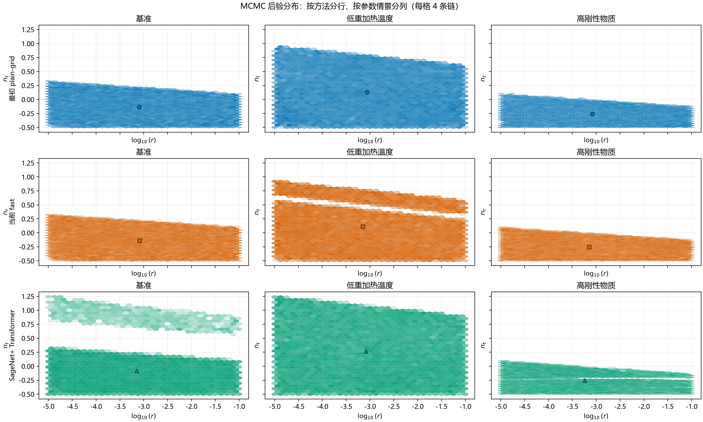
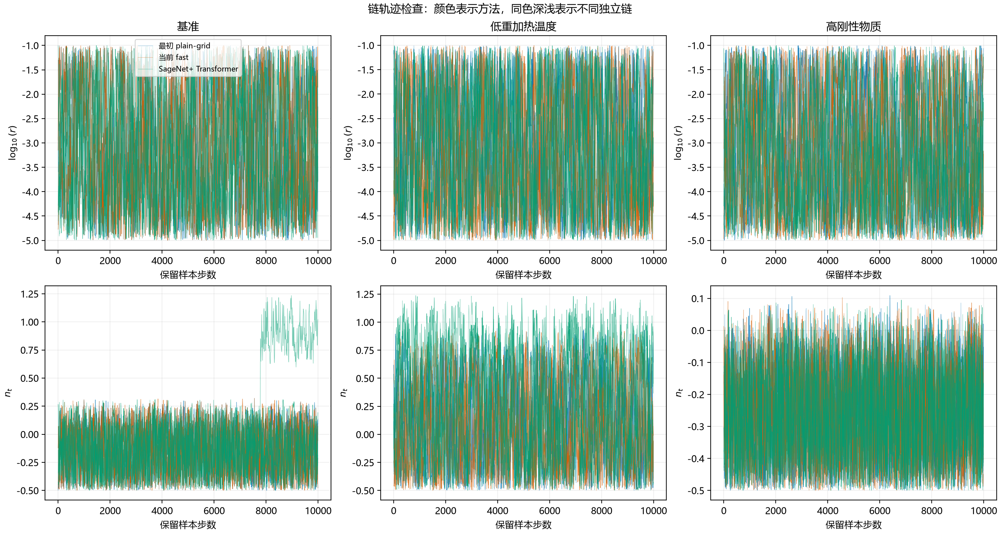
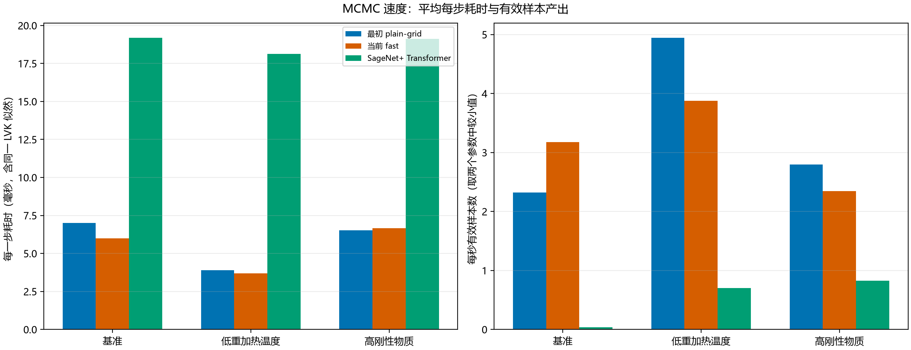
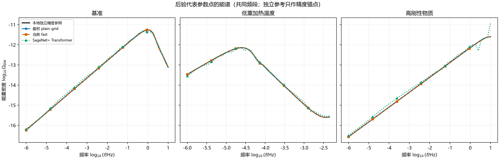
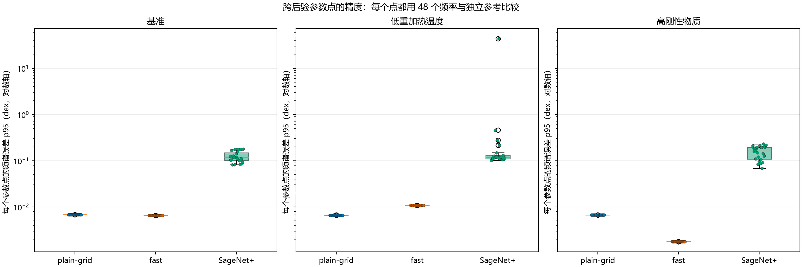

# stiffGWpy 与 SageNet+：LVK 数据下的 MCMC 对比

实验时间：2026-09-24T11:44:53+0800
代码版本：stiffGWpy `3fbb874542d3a48a95f2674684a4ca8afda8117a`；SageNet `ab7face439b5ad47a8551d61e1a3fbdfd2d0ac55`。

## 结论先读

本次补充实验使用相同 LVK 数据、似然和自由参数，比较最初 plain-grid、当前 fast 与 SageNet+ Transformer。MCMC 从当前参数附近随机提出新参数，再按似然接受或拒绝；每个方法和情景有 4 条链、每条保留 10,000 个样本，共 360,000 个保留样本。速度按预热后的采样阶段计算；预热、模型载入和独立精度参照另行计时。
当前 fast 每步耗时更低；能谱精度需结合下文多个后验参数点的误差分布判断。低重加热温度情景不覆盖 LVK 观测频段，不用于判断谁更符合观测。

## 速度与后验结果

每步时间越低越快；ESS 越高表示链中重复信息越少；R-hat 越接近 1，四条链越一致。均值和标准差描述参数后验位置与宽度，不是算法误差。

| 情景 | 方法 | 每步毫秒 | 每秒最低 bulk ESS | 最低 bulk ESS | 最低 tail ESS | 最大 rank R-hat | log10(r) 均值±标准差 | n_t 均值±标准差 |
|---|---|---:|---:|---:|---:|---:|---:|---:|
| 基准 | 最初 plain-grid | 7.013 | 2.32 | 651 | 2771 | 1.005 | -3.096±1.154 | -0.139±0.210 |
| 基准 | 当前 fast | 5.994 | 3.18 | 762 | 2886 | 1.004 | -3.086±1.152 | -0.142±0.209 |
| 基准 | SageNet+ Transformer | 19.189 | 0.04 | 30 | 11 | 1.096 | -3.144±1.136 | -0.085±0.314 |
| 低重加热温度 | 最初 plain-grid | 3.907 | 4.94 | 773 | 2181 | 1.008 | -3.058±1.156 | 0.125±0.377 |
| 低重加热温度 | 当前 fast | 3.682 | 3.87 | 571 | 1234 | 1.003 | -3.148±1.153 | 0.110±0.376 |
| 低重加热温度 | SageNet+ Transformer | 18.137 | 0.70 | 509 | 1358 | 1.014 | -3.081±1.153 | 0.264±0.464 |
| 高刚性物质 | 最初 plain-grid | 6.515 | 2.80 | 728 | 3258 | 1.006 | -3.080±1.147 | -0.257±0.145 |
| 高刚性物质 | 当前 fast | 6.652 | 2.35 | 624 | 2452 | 1.008 | -3.144±1.152 | -0.256±0.147 |
| 高刚性物质 | SageNet+ Transformer | 19.118 | 0.82 | 630 | 1838 | 1.006 | -3.237±1.105 | -0.255±0.149 |

## 采样是否可靠

每种方法、每个情景使用 4 条不同随机种子的链；起点分散在 `log10(r)`=-4.6 到 -1.8、`n_t`=-0.45 到 0。每条链预热 4,000 步，再保留 10,000 步。
R-hat 是看不同链是否汇合；bulk ESS 看后验主体有多少有效信息，tail ESS 看两端区间的信息量；MCSE 是均值因有限采样带来的估算误差。采用秩标准化 folded split R-hat 与 Geyer ESS 计算。

Stan 的诊断建议默认至少 4 条链；最终结果通常要求 R-hat < 1.01，bulk ESS 大于链数的 100 倍，tail ESS 检查 5% 与 95% 尾部。[诊断说明](https://mc-stan.org/learn-stan/diagnostics-warnings.html) 本报告把四链总 ESS 400 作为参考线；它不是对任何科学问题都足够的保证。

| 情景 | 方法 | 最大 R-hat | 最低 bulk ESS | 最低 tail ESS | 最大均值 MCSE（log10r / nt） | 诊断门槛是否都达到* |
|---|---|---:|---:|---:|---:|---|
| 基准 | 最初 plain-grid | 1.005 | 651 | 2771 | 0.04985 / 0.004784 | 是 |
| 基准 | 当前 fast | 1.004 | 762 | 2886 | 0.04731 / 0.004522 | 是 |
| 基准 | SageNet+ Transformer | 1.096 | 30 | 11 | 0.04437 / 0.07294 | 否 |
| 低重加热温度 | 最初 plain-grid | 1.008 | 773 | 2181 | 0.04423 / 0.01337 | 是 |
| 低重加热温度 | 当前 fast | 1.003 | 571 | 1234 | 0.04869 / 0.01541 | 是 |
| 低重加热温度 | SageNet+ Transformer | 1.014 | 509 | 1358 | 0.04448 / 0.02072 | 否 |
| 高刚性物质 | 最初 plain-grid | 1.006 | 728 | 3258 | 0.04498 / 0.00252 | 是 |
| 高刚性物质 | 当前 fast | 1.008 | 624 | 2452 | 0.0506 / 0.002956 | 是 |
| 高刚性物质 | SageNet+ Transformer | 1.006 | 630 | 1838 | 0.0496 / 0.003151 | 是 |

**基准 SageNet+ 的重要问题**：第 2 条链有 19.5% 的样本落在 `n_t>0.7`，另外三条链均未进入该区域；占四链样本的 4.9%。固定 `log10(r)=-3.2` 时，SageNet+ 在 `n_t=-0.15` 的 LVK 频段覆盖为 100%，在 `n_t=0.7` 降为 0%；高斜率区域的似然因而不再由 LVK 频段约束。这对应 R-hat 1.096、bulk ESS 30、tail ESS 11。该组合未通过混合检查，均值和标准差不能当成稳定后验估计。一个抽到该高斜率区域的精度检查点还被 fast 的物理边界保护拒绝，因此不进入三方法误差排名。

*同时达到表中三个参考值才标为‘是’；即使通过，也只说明本报告设定下的链诊断较好。

## 精度：检查整个后验范围

本地连续-sigma 高精度求解器（`rtol=1e-7`、`z_tail=8`）只作独立参照，不参与 MCMC。每个情景从三种方法各随机抽取 8 个后验参数点（共 24 点），每点在三种方法共同覆盖的 48 个频率上对比。下表是这些抽查点的频谱误差 p95，再汇总中位数 / 95 分位 / 最大值；它不能保证覆盖所有稀有后验区域。

| 情景 | 方法 | 有效参数点 / 24 | 参数点误差 p95 的中位数 / 95分位 / 最大值（dex） |
|---|---|---:|---:|
| 基准 | 最初 plain-grid | 23 / 24 | 0.006796 / 0.006796 / 0.006796 |
| 基准 | 当前 fast | 23 / 24 | 0.006515 / 0.006515 / 0.006515 |
| 基准 | SageNet+ Transformer | 23 / 24 | 0.1176 / 0.1775 / 0.1791 |
| 低重加热温度 | 最初 plain-grid | 22 / 24 | 0.006596 / 0.006718 / 0.006733 |
| 低重加热温度 | 当前 fast | 22 / 24 | 0.01085 / 0.01085 / 0.01085 |
| 低重加热温度 | SageNet+ Transformer | 22 / 24 | 0.119 / 0.4494 / 43.48 |
| 高刚性物质 | 最初 plain-grid | 24 / 24 | 0.006698 / 0.006698 / 0.006698 |
| 高刚性物质 | 当前 fast | 24 / 24 | 0.001783 / 0.001783 / 0.001783 |
| 高刚性物质 | SageNet+ Transformer | 24 / 24 | 0.1631 / 0.2191 / 0.2306 |
- 基准 有 1 个抽查点未进入共同精度比较：点 22: fast physical guard。物理保护拒绝的点单独报告，不把它算成普通精度误差。
- 低重加热温度 有 2 个抽查点未进入共同精度比较：点 3: fast physical guard, 点 18: fast physical guard。物理保护拒绝的点单独报告，不把它算成普通精度误差。

图中展示同一情景各后验参数点的误差分布；每个点的误差先在 48 个频率上计算，再取 p95。高刚性物质与基准情景可以用于观测频段内的数值精度比较。低重加热温度情景的 LVK 覆盖为 0%，结果只能用于数值对照，不能解释为数据支持度。0.01 dex 约对应 2.3% 的谱幅差，0.1 dex 约对应 26%。

被拒提议按原因分别记录；物理保护表示模型适用边界，不等同于数值错误：

| 情景 | 方法 | 被拒提议原因与次数 |
|---|---|---|
| 基准 | 最初 plain-grid | 物理边界保护 1793 次 |
| 基准 | 当前 fast | 物理边界保护 1776 次 |
| 基准 | SageNet+ Transformer | 无效数值/似然 1261 次 |
| 低重加热温度 | 最初 plain-grid | 物理边界保护 1914 次 |
| 低重加热温度 | 当前 fast | 未收敛 589 次, 无效数值/似然 2974 次, 物理边界保护 1668 次 |
| 低重加热温度 | SageNet+ Transformer | 无效数值/似然 1567 次 |
| 高刚性物质 | 最初 plain-grid | 物理边界保护 622 次 |
| 高刚性物质 | 当前 fast | 物理边界保护 629 次 |
| 高刚性物质 | SageNet+ Transformer | 无效数值/似然 1760 次 |

## 场景和参数设置

三个固定背景情景分别为：基准（`kappa10=0.01, T_re=2000 GeV, DN_re=20`）、低重加热温度（`0.01, 10 GeV, 10`）、高刚性物质（`1, 2000 GeV, 30`）。‘低温’表示再加热结束温度较低；‘高刚性’表示 10 MeV 时刚性物质相对光子的能量比较高。

| 参数 | 通俗含义 | 采样设置 |
|---|---|---|
| `log10(r)` | 原初引力波强度比例的 10 为底对数；加 1 表示 `r` 增大 10 倍 | 自由参数；-5 到 -1 均匀取值 |
| `n_t` | 引力波谱随频率变化的斜率 | 自由参数；-0.5 到 1.5 |
| `kappa10` | 10 MeV 时刚性物质能量与光子能量之比 | 按上述三种情景固定 |
| `T_re` | 再加热结束温度，单位 GeV | 按上述三种情景固定 |
| `DN_re` | 暴胀结束到再加热结束期间的膨胀量 | 按上述三种情景固定 |
| `cr` | 是否启用单场暴胀一致性关系 | 固定为 0，允许 `n_t` 独立变化 |
| `Omega_bh2` / `Omega_ch2` | 普通物质 / 暗物质密度 | 0.0223828 / 0.1201075 |
| `H0` / `A_s` | 当前膨胀速度 / 标量扰动强度 | 67.32117 km/s/Mpc / 2.100549e-9 |
| `DN_eff` | 起始额外相对论粒子贡献 | 固定 0；引力波贡献由各求解器计算 |

提议步幅固定为 `log10(r)=0.35`、`n_t=0.12`。plain-grid 按早期粗网格档重建；fast 使用当前正式档；SageNet+ 使用 Transformer、CPU 单线程。三者共享同一 LVK O1/O2/O3 数据（54593 行）和三次插值卡方似然。计时期间屏蔽重复的控制台保护提示，但仍逐项计数；这样不会把终端输出速度当成模型计算速度。
求解器设置：plain-grid `h=0.02, col_step=8, z_tail=5, phase_max=0, construct 网格`；fast `h=0.005, col_step=8, z_tail=5, phase_max=0.25, goal 网格并拆分再加热断点`。SageNet 模型载入 0.047 秒；采样前预热时间记录在 JSON 的 `warmup_s`，均不计入每步采样时间。硬件为 AMD Ryzen 9 7945HX with Radeon Graphics；固定使用 2 个 Numba 线程、1 个 BLAS/Torch 线程。

## 图表

颜色统一为蓝色 plain-grid、橙色 fast、绿色 SageNet+。

### 后验样本

每个点是保留的参数组合；密集处表示当前设置下采样较多。样本相关，不能把 40,000 个保留值当成 40,000 份独立信息。

### 链轨迹

检查链是否重叠、是否还在持续漂移。颜色代表方法，同色深浅代表独立链。

### 速度和有效样本

时间仅计入预热后的保留阶段；模型加载、采样预热和独立精度参照不混入。

### 代表性能谱

展示各方法后验合并样本中位参数附近的能谱。

### 后验范围精度

箱体和点展示 24 个后验参数点的逐点误差 p95；纵轴使用对数刻度，方便同时观察小误差与大误差。

## 对 fast 的评价

- **速度**：fast 比 SageNet+ 快约 2.9–4.9 倍；比 plain-grid 在基准 / 低温情景快 17% / 6%，在高刚性情景慢 2%；每秒有效样本分别变化 +37% / -22% / -16%。这些速度值只适用于本次机器、版本和线程设置。
- **精度**：抽到且可比较的参数点中，fast 的误差中位数在 3/3 个情景低于 SageNet+；具体见上表。基准 SageNet+ 链未收敛，其误差汇总只描述已抽到的可比较区域，不代表完整后验。
- **相对 plain-grid 精度**：fast 在基准和高刚性情景的后验参数点误差中位数较低；低温情景较高，但该情景的 LVK 覆盖为 0%。
- **观测解释边界**：低温情景 LVK 频段覆盖为 0%，不支持拟合优劣结论；本报告比较的是数值频谱相对本地参考的误差。
- **科研使用判断**：fast 与 plain-grid 三个情景都达到本报告的链诊断参考；SageNet+ 基准与低温情景未达到，因此这份三方后验比较整体尚未全部通过科研生产验收。基准 SageNet+ 还存在不同链落入不同覆盖区域的问题。

## 原始数据与复现

- `results.json`：每种方法、情景的汇总、诊断量、逐参数点精度结果和环境信息。
- `docs\mcmc_sagenet_compare\posterior_chains_20260924.npz`：四条链全部保留样本、起点和逐链耗时；随报告一并归档。
- `scripts/benchmark_mcmc_sagenet_compare.py`：采样、诊断、精度核验与绘图脚本。
- LVK 数据 SHA-256：`c99da16a95bfaf6b68f9584bf7d57417570e8bb0a25c501903d0f11f40953408`；SageNet Transformer 权重 SHA-256：`95d87b483472fd4a73f6de5ba85213358ed138bf75a2d26d8bd1ce4181a6d485`。
- 已按旧样本文件名和报告路径检索公开网络，未找到可核验的原始后验样本；远端 Git 历史也没有该文件。旧本地链只有三条相同起点的短链，未作为新证据。本次样本由当前报告版本重新生成并归档。

结果限定于报告列出的代码版本、SageNet 模型权重、CPU 环境、数据和参数范围；不代表其他模型权重或所有参数空间。
